# PROGRAMMING FOR DATA SCIENCE - FIT - HCMUS
# I. Group infomation:

Class ID: 21KHDL1

|Student ID|Full Name|
|---|---|
|21127229|Dương Trường Bình|
|21127616|Lê Phước Quang Huy|

# II. Project Information:
## **_01. Dataset:_**
- **Link:** [Spotify Tracks Dataset](https://www.kaggle.com/datasets/maharshipandya/-spotify-tracks-dataset).
- **Description:**
    - [Spotify Tracks Dataset](https://www.kaggle.com/datasets/maharshipandya/-spotify-tracks-dataset) is a dataset of **Spotify** tracks over a range of 125 different genres.  
    - Each track is identified by its Spotify ID and accompanied by metadata such as artist names, album name, track name, and popularity.
    - The dataset provides a rich set of audio features, offering insights into the musical characteristics of each track.
    - These features include `acousticness`, `danceability`, `energy`, 
    `instrumentalness`, `liveness`, `loudness`, `speechiness`, ...etc.
- **License:** `Database: Open Database, Contents: © Original Authors`. The combined license structure of the `Spotify Tracks Dataset`, comprising the ODbL and the acknowledgment of the original authors' copyright, permits its usage for non-commercial endeavors like learning and research. Consequently, the dataset's utilization in this project adheres to the license terms and does not compromise the intellectual property rights of its creators 

## **_02. Data exploring and preprocessing:_**
### **Basic information**
- Meaning of each row: represents a single song from Spotify and its attributes
- Duplicate rows: 450. We have removed them.
- Meaning of each column

| Column          | Description             |
|-----------------|--------------------------------------------------------------------------------------------------------------------------------|
| `track_id`      | The Spotify ID for the track                                                                                                   |
| `artists`       | The names of the artists who performed the track, separated by ';' if there is more than one artist                               |
| `album_name`    | The name of the album in which the track appears                                                                              |
| `track_name`    | The name of the track                                                                                                          |
| `popularity`    | The popularity of the track on a scale from 0 to 100, based on the total number of plays and recency                             |
| `duration_ms`   | The length of the track in milliseconds                                                                                        |
| `explicit`      | Indicates whether the track has explicit lyrics (true = yes, false = no or unknown)                                           |
| `danceability`  | Describes how suitable a track is for dancing, with 0.0 being least danceable and 1.0 being most danceable                     |
| `energy`        | A measure from 0.0 to 1.0 representing the intensity and activity of the track                                                |
| `key`           | The key the track is in, mapped to pitches using standard Pitch Class notation                                                |
| `loudness`      | The overall loudness of the track in decibels (dB)                                                                            |
| `mode`          | Indicates the modality (major = 1, minor = 0) of a track's melodic content                                                    |
| `speechiness`   | Detects the presence of spoken words in a track, with values above 0.66 likely indicating spoken words                          |
| `acousticness`  | A confidence measure from 0.0 to 1.0 of whether the track is acoustic                                                         |
| `instrumentalness` | Predicts whether a track contains no vocals, with values closer to 1.0 indicating instrumental tracks                         |
| `liveness`      | Detects the presence of an audience in the recording, with higher values indicating a greater likelihood of a live performance |
| `valence`       | A measure from 0.0 to 1.0 describing the musical positiveness conveyed by a track                                              |
| `tempo`         | The overall estimated tempo of a track in beats per minute (BPM)                                                               |
| `time_signature`| An estimated time signature, indicating how many beats are in each bar                                                          |
| `track_genre`   | The genre in which the track belongs                                                                                          |

- Column's data type:

    - `object`: 6 columns: `track_id`, `artists`, `album_name`, `track_name`, `track_genre`, `explicit`
    - `int64`: 5 columns: `popularity`, `duration_ms`, `key`, `mode`, `time_signature`
    - `float64`: 9 columns: `danceability`, `energy`, `loudness`, `speechiness`, `acousticness`, `instrumentalness`, `liveness`, `valence`, `tempo`

    - Data type of object columns:

        |Column| Data Type |
        |---|---|
        |track_id|{<class 'str'>}|
        |artists|{<class 'str'>, <class 'float'>}|
        |album_name|{<class 'str'>, <class 'float'>}|
        |track_name|{<class 'str'>, <class 'float'>}|
        |track_genre|{<class 'str'>}|                                                                                 |

- Missing values each row:
    - 113549 rows missing 0 values
    - 1 row missing 3 values

### **Data Distribution**

- **Numerical columns**

[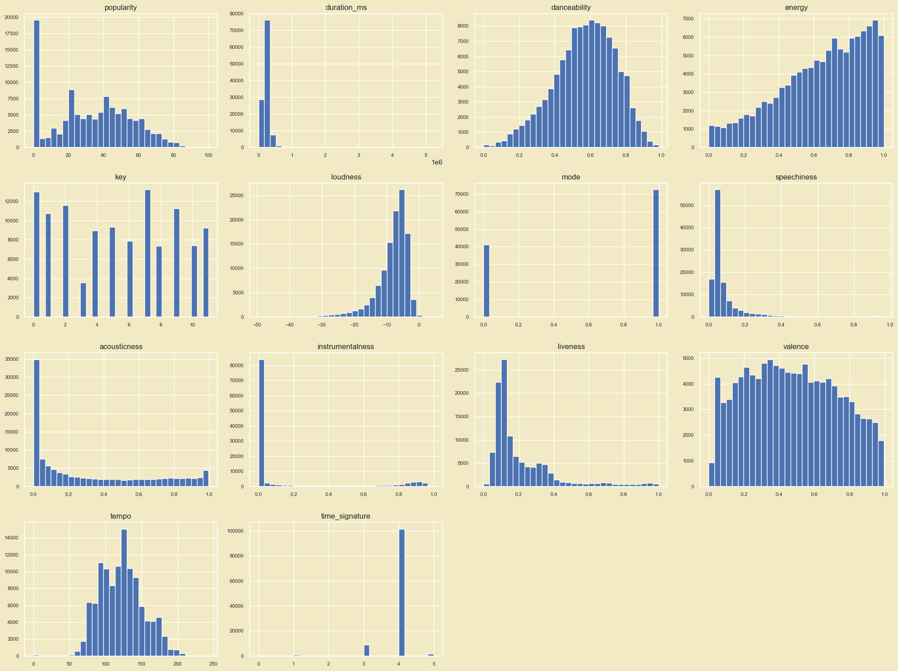](./image/numerical_columns.png)
- **Categorical columns**

[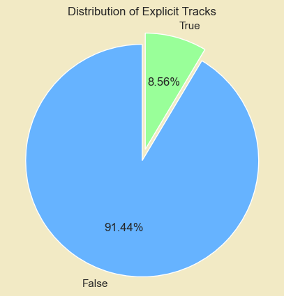](./image/explicit.png)

[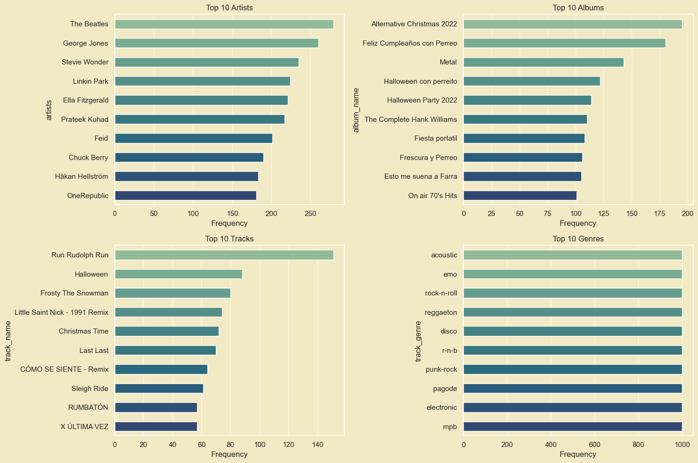](./image/artist_album_track_genre.png)

### **Abnormal values and outliers**

- The distribution and the range of values of each column are reasonable. There are no abnormal values
- Boxplot to check outliers
[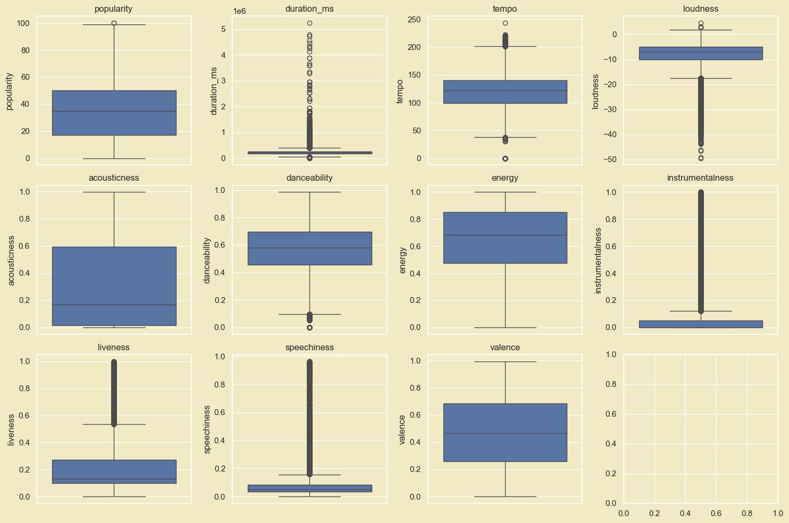](./image/boxplot.png)

**📙 Comment**

- `popularity`, `acousticness`, `energy`, `valence` have no outliers. (The `popularity` column has 1 outlier, but it is not significant.)
- The remaining columns exhibit a substantial number of outliers, which is understandable as they are all continuous variables. These variables have a wide range of values, do not follow a normal distribution, and are influenced by various factors of a song. Therefore, it is justifiable not to remove these outliers, as they contribute to the diversity and complexity of the dataset, reflecting the diverse nature of musical attributes.
### **Correlation between variables**

- We use correlation matrix and heatmap to check the correlation between variables

**📙 Comment**

- The majority of columns exhibit very low correlation with each other, with magnitudes below 0.1.
- The columns with the highest correlation are `energy` and `loudness` with a correlation of 0.76, `loudness` and `acousticness` with a correlation of -0.59, and `energy` and `acousticness` with a correlation of -0.73. This is understandable as the energy of a song is inversely proportional to its acousticness, and the loudness of a song is directly proportional to its energy.
- `popularity` has a low correlation with all other variables, which is understandable as popularity is a subjective measure influenced by factors such as the artist's popularity, release date, and genre.
- `instrumentalness` and `loudness` have a negative correlation of -0.43, which is understandable as instrumental songs tend to be quieter than songs with vocals.
- `danceability` and `valence` have a correlation of 0.43, which is understandable as songs with high valence (positiveness) are more likely to be danceable.

## **_03. Meaningful questions:_**    
### **Question 1: How do different genre-related characteristics affect the popularity of songs? (This is an open-ended question)** 
- **Benefits:**
    - **Understanding Audience Trends**: This can be useful in creating music content or events that resonate with the audience.
    - **Planning for Events/Programs**: Knowing which genre is most popular can help you plan your event or program to attract the widest audience.
    - **Supporting Advertising and Marketing**: Optimizing advertising and marketing strategies.
    - **Artist Development Strategy**: For music artists, understanding the current trends and characteristics of different genres can support the development of their strategy, from genre selection to building an image that appeals to the target audience.
- **How to answer this question:**
    - **Analyzing genre has the highest frequency of songs**

    > This is the characteristic of the dataset, the author has collected about 1000 songs of each genre to create this dataset.

    - **Top 10 Genres with Highest Average Popularity**
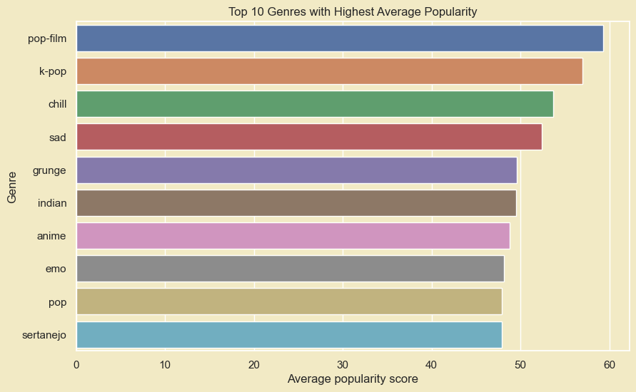
    > - Based on the chart, we observe that the highest average popularity score for a genre is approximately 60, not significantly higher than the rest in the top 10.
    > - We also see diversity within each genre, with notable genres including `pop-film`, `k-pop`, `chill`, and `sad`. 
    - **Genres with Highest Average Explicit Ratio**
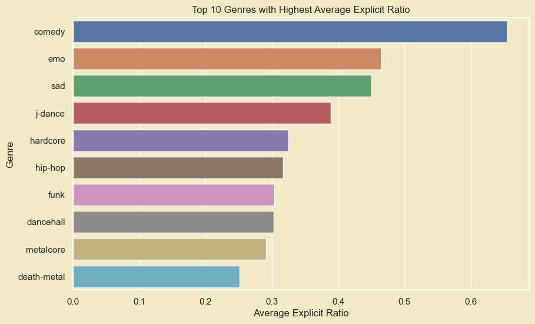
    > - Based on the chart, the `comedy` genre has the highest `Explicit` ratio by a significant margin.
    > - Genres with a high explicit ratio may attract listeners seeking music with edginess and linguistic freedom.
    - **Genres has the highest number of songs in the top 0.001% (~110) most popular songs**
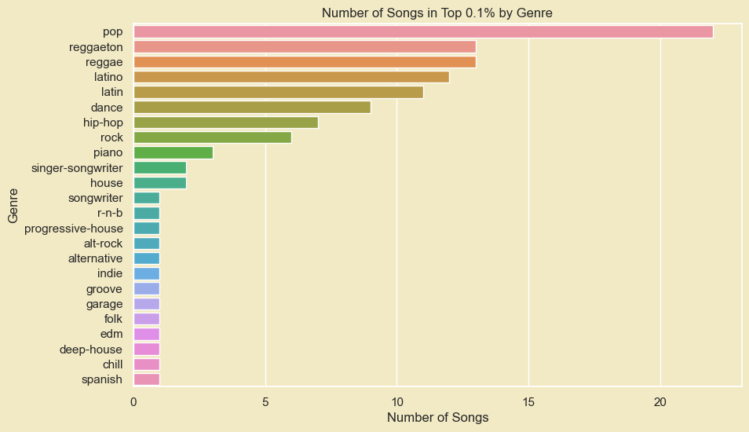
    > - Based on the chart, in the top `0.001%` of popular songs, there is a large diversity of genres.
    > - The `pop` genre is one of the most popular music genres worldwide.
    - **Genres has the highest ratio of live songs**
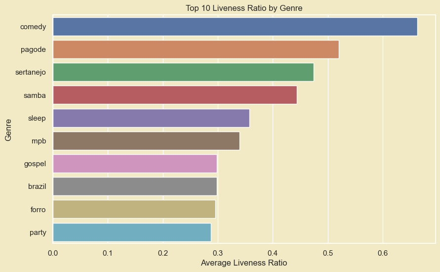
    > - Based on the chart, the `comedy` genre has the highest `live` ratio
    > - A high ratio of live songs may reflect the audience's preference for live recordings, with their passion for the lively atmosphere and direct interaction.
    > - Artists and bands often have higher creative freedom during live performances. This can help create unique and more intimate performance versions that resonate closely with the audience.
    - **Correlation between `loudness` and `energy` in the top 3 genres with the highest average popularity**
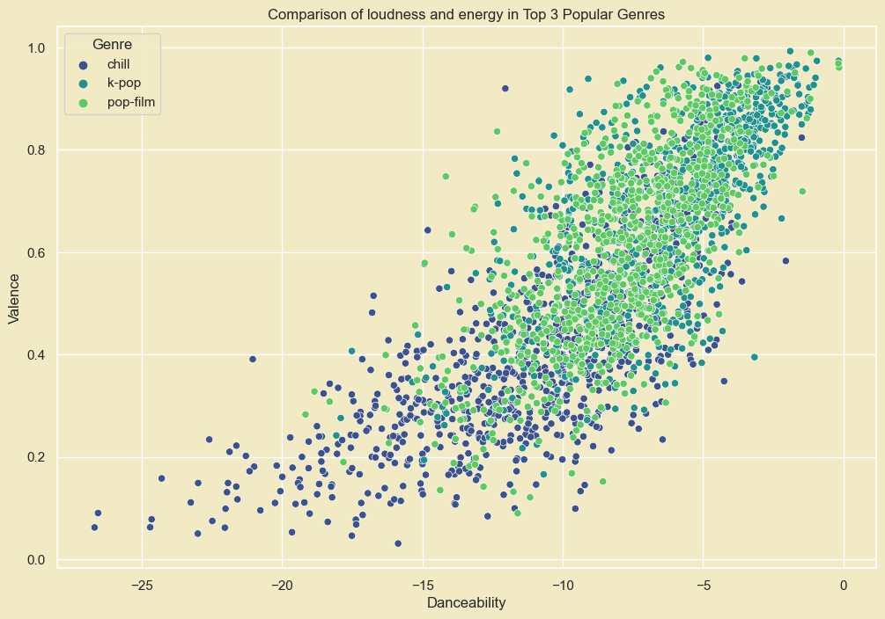
    > - According to the chart, the correlation between `loudness` and `energy` in the selected top 3 music genres is quite significant. This may imply that songs with high `loudness` also tend to have high `energy` in these genres.

> **Answer:** There's no single correct answer to the question posed by our group. Answering this question requires looking at it from various perspectives. Each viewpoint provides different responses suitable for that particular aspect. After this analysis, we hope artists can create hits that become even more widely popular.

### **Question 2: How should artists choose their music genres?**

- Purpose: To help artists define their musical identity by guiding them on genre selection. It encourages artists to make informed choices based on their personal style, strengths, diversity exploration, or trending genres. The goal is to assist artists in shaping their artistic identity effectively

- How to answer this question:

    &#x1F4A1; To answer this, we'll break it down into two questions:

    1. **Choosing Personal vs. Trending Genres**:
    
    Should artists pick genres they like or go for what's popular?

    

    - There's a noticeable overlap between popular music genres and those embraced by renowned artists. Out of 57 popular genres, **35** stand out not just as crowd favorites but also as the chosen realms of passion for celebrated artists. Moreover, these artists venture into 17 different genres, showcasing not only their alignment with trends but also their independence and creativity in discovering unique musical genres with a distinctive personal touch.

    

    2. **Focus vs. Diversification**:

    Is it better for artists to stick to a few genres or expand their genre range?

    - How many genres is considered too many?
    

    😊 Therefore, we can consider artists with **4** or more genres as those with a diverse range.

    [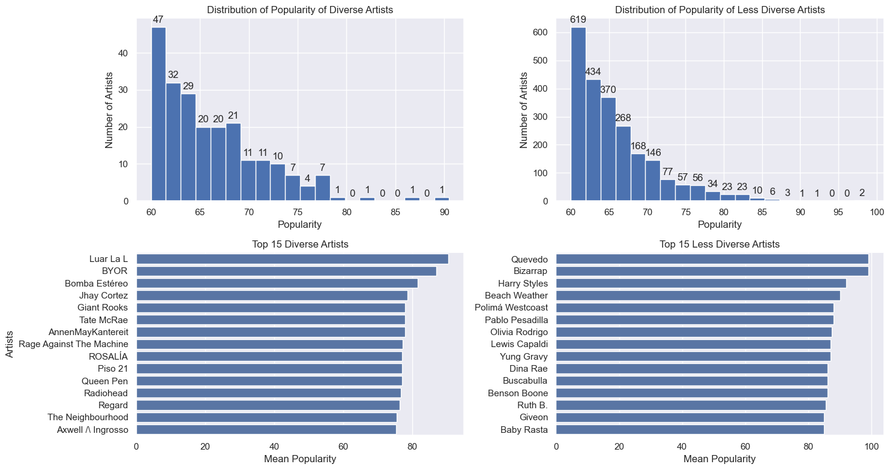](./image/top15.png)

    => The popularity distribution among diverse and less diverse artists appears remarkably similar, indicating that the number of genres an artist explores does not significantly impact their popularity.

        
    **Answer**: 
    - If a genre is currently popular, has broad appeal, and aligns with the artist's preferences, they should consider choosing that genre for increased chances of success.

    - If the artist's preferred genre is less popular, they can still pursue it if they have a genuine passion for it. Many successful artists have built substantial fan bases by staying true to their unique style. Additionally, exploring other genres might open up new avenues for career development.

    - The number of genres an artist chooses does not significantly impact their popularity. Taylor Swift, for example, is known for her sweet ballads but has successfully ventured into pop rock, country, and R&B, attracting a diverse fanbase.

    - Artists should avoid frequent genre changes, as this may make it challenging for fans to follow and support them. It's also advisable not to force oneself into a genre they don't enjoy, as it may hinder the creation of high-quality music.

### **Question 3: How can we suggest songs based on a user's current listening preferences?**
- **Benefits:**
    - The goal is to recommend songs to users based on the similarity between songs, helping listeners discover music they might enjoy based on their preferences.
- **How to answer this question:**
    - Utilize Euclidean distance to measure the similarity between songs. The smaller the Euclidean distance, the more similar two songs are from the perspective of the selected features.
    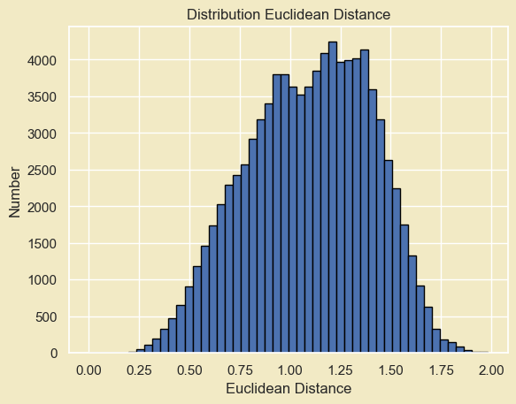
    - Select K songs with the smallest distances. These are the songs that the system highly rates in similarity to the user's liked song.
    - Extract information such as song names and artists from the selected songs and return this information as recommendations for the user.

> **Result:** Recommend the top 5 tracks for the user in descending order of similarity, based on the calculated Euclidean distances.

- Câu hỏi 4:

## **_04. More Information:_**
- [Github](https://github.com/duongtruongbinh/Prog4DS_FinalProject)
- [Trello](https://trello.com/b/TL2hTrzA/prog4dsfinalproject)
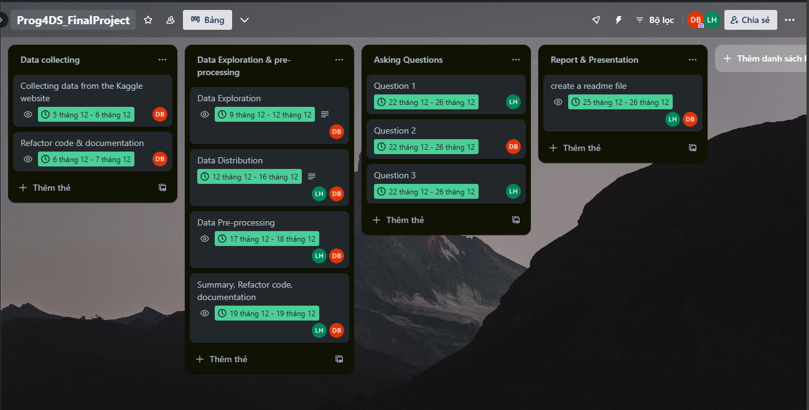

## **_05. Planning:_**
- [Planning](https://docs.google.com/spreadsheets/d/1C74QGwhZZZx5uv8j9Z5kSmUOsvY673bq0KFGbLohAOI/edit?usp=sharing
)
