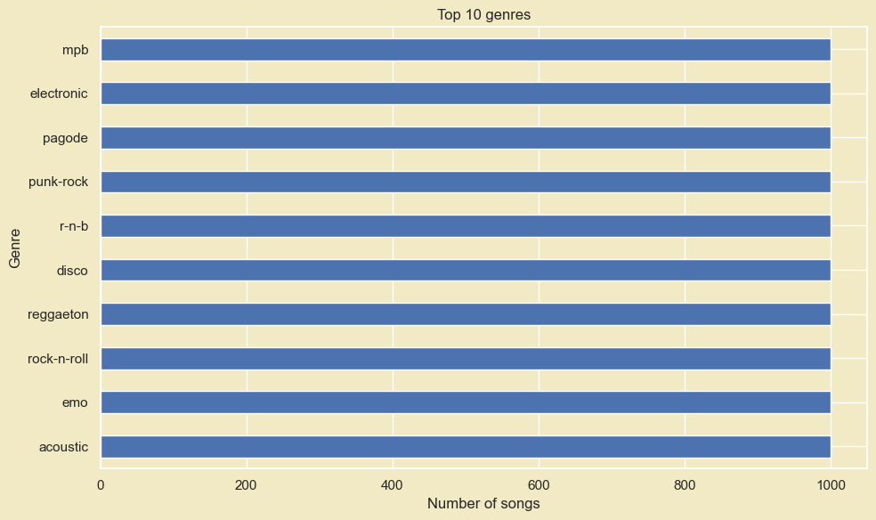

# PROGRAMMING FOR DATA SCIENCE - FIT - HCMUS
## Final Project - Thu thập, phân tích cho trả lời câu hỏi về bộ dữ liệu Spotify Tracks Dataset
### I. Group infomation:

Class ID: 21KHDL1

|Student ID|Full Name|
|---|---|
|21127616|Lê Phước Quang Huy|
|21127229|Dương Trường Bình|

### II. Project Information:
#### **_01. Dataset:_**
- **Link:** [Spotify Tracks Dataset](https://www.kaggle.com/datasets/maharshipandya/-spotify-tracks-dataset).
- **Description:**
    - [Spotify Tracks Dataset](https://www.kaggle.com/datasets/maharshipandya/-spotify-tracks-dataset) is a dataset of **Spotify** tracks over a range of 125 different genres.  
    - Each track is identified by its Spotify ID and accompanied by metadata such as artist names, album name, track name, and popularity.
    - The dataset provides a rich set of audio features, offering insights into the musical characteristics of each track.
    - These features include `acousticness`, `danceability`, `energy`, 
    `instrumentalness`, `liveness`, `loudness`, `speechiness`, ...etc.
- **License:** `Database: Open Database, Contents: © Original Authors`. The combined license structure of the `Spotify Tracks Dataset`, comprising the ODbL and the acknowledgment of the original authors' copyright, permits its usage for non-commercial endeavors like learning and research. Consequently, the dataset's utilization in this project adheres to the license terms and does not compromise the intellectual property rights of its creators 

#### **_02. Data exploring and preprocessing:_**
- **Understand basic information and Preprocessing dataset:**
    - Handle duplicated rows, missing values, abnormal values and outliers
- **Data distribution:**
    - Numerical columns
    - Categorical columns
- **Visualize data**

#### **_03. Meaningful questions:_**
- Question 1: What is the most popular genre?
    - Number of songs for each genre.
    - Average popularity score for each genre.
    - Explicit ratio.
    - Genres in the top ~110 most popular songs.
    - Ratio of live songs for each genre.
    - Comparing the correlation between loudness and energy in the top 3 most popular genres.

> **Result:** There's no single correct answer to the question posed by our group. Answering this question requires looking at it from various perspectives. Each viewpoint provides different responses suitable for that particular aspect. After this analysis, we hope artists can create hits that become even more widely popular.

- Question 2:

- Question 3: How can we suggest songs based on a user's current listening preferences?
    - Utilize Euclidean distance to measure the similarity between songs. The smaller the Euclidean distance, the more similar two songs are from the perspective of the selected features.
    - Select K songs with the smallest distances. These are the songs that the system highly rates in similarity to the user's liked song.
    - Extract information such as song names and artists from the selected songs and return this information as recommendations for the user.

> **Result:** Recommend the top 5 tracks for the user in descending order of similarity, based on the calculated Euclidean distances.

- Câu hỏi 4:

#### **_04. More Information:_**
- [Github](https://github.com/duongtruongbinh/Prog4DS_FinalProject)
- [Trello](https://trello.com/b/TL2hTrzA/prog4dsfinalproject)

#### **_05. Planning:_**
- [Planning](https://docs.google.com/spreadsheets/d/1C74QGwhZZZx5uv8j9Z5kSmUOsvY673bq0KFGbLohAOI/edit?usp=sharing
)
